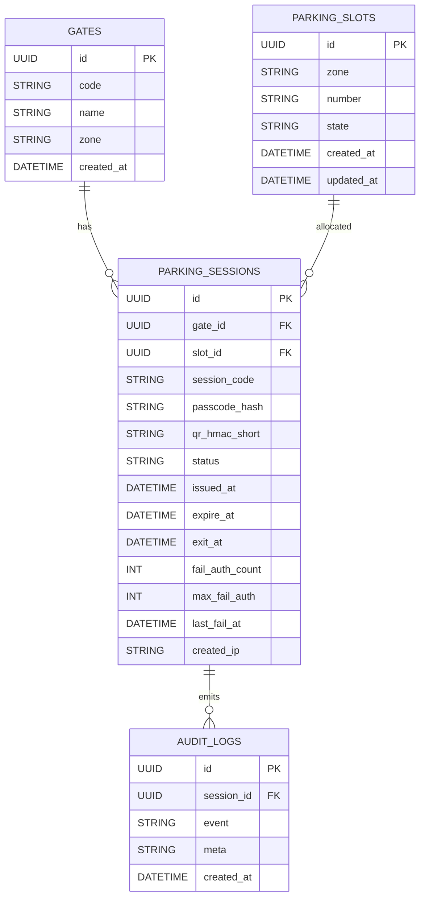
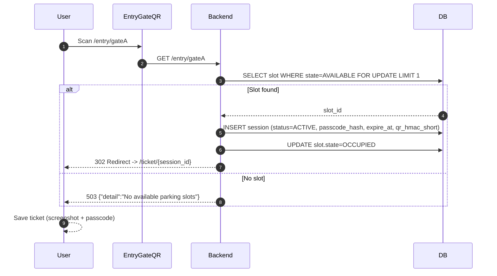
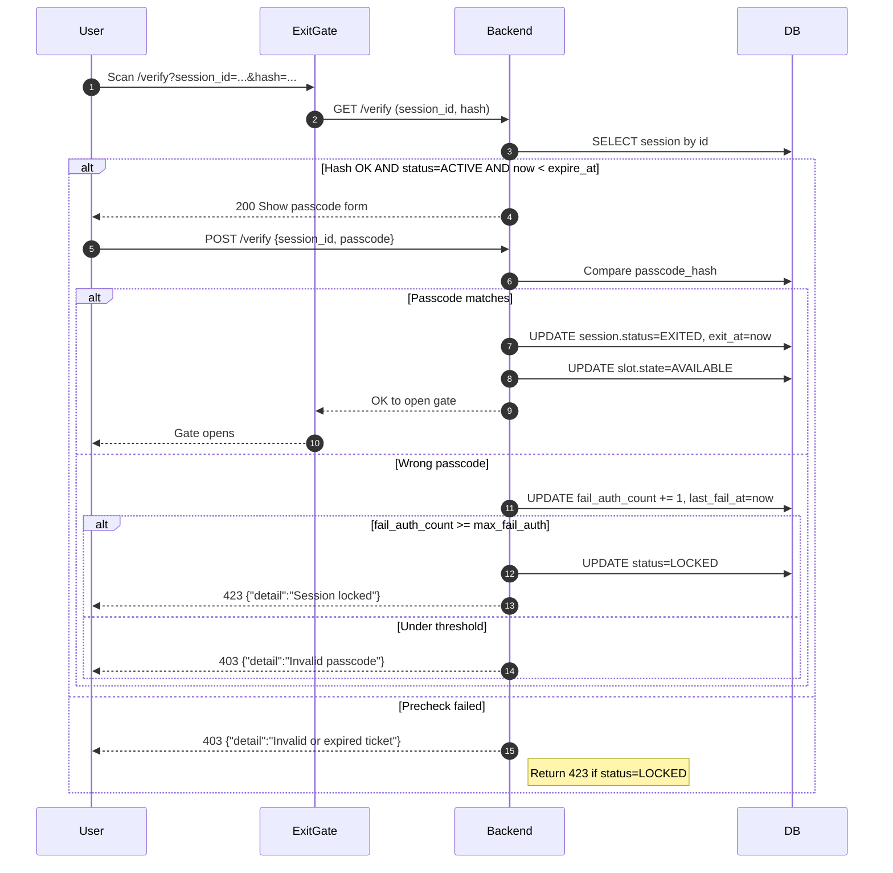

# 🚗 Guest Parking QR System — Design Summary

## 🎯 Objective
A secure, anonymous parking management system where guests scan a QR code to enter, receive a digital ticket, and verify it on exit — without needing login or a mobile app.

**Example User Stories**
- As a guest, I want to scan a QR code at the entrance to get a parking spot and digital ticket without needing to install an app.
- As a guest, I want to scan my digital ticket at the exit and enter a simple code to leave the parking garage quickly.
- As a parking administrator, I want the system to be secure against basic ticket forgery or reuse.

---

## 🔧 Core Mechanism

### 1) Gate Entry (Static QR)
User scans the entry gate’s static QR (e.g. `https://parking.univ.edu/entry/gateA`).

Backend assigns an available slot and creates a parking session:

- `session_id` — unique identifier  
- `passcode` — random 6-character alphanumeric code (stored as **hash**, not plain)  
- `hash` — short HMAC-SHA256 **(first 10 hex chars)** for QR integrity  
- `expire_at` — validity deadline (e.g. now + 6 hours) **(renamed from `expiry_time`)**  
- `status` — `ACTIVE` on issue

User is shown a digital ticket, e.g.:

Slot: A-22

Passcode: 8K2L9M

QR: https://parking.univ.edu/ticket?session=S-20251027-00057&hash=f89e6da4b5

User keeps the passcode and screenshot of the ticket.

---

### 2) Exit Validation
At the exit gate, the user scans their ticket QR.

Server validates preconditions:

- `hash` matches `HMAC(secret, session_id)` (ensures authenticity)
- `Session` exists and `status == ACTIVE`
- `now < expire_at` (**ticket not expired**)

Then the system prompts for **passcode**:

- **If passcode matches**: mark session `EXITED`, record exit time, free slot, and open gate.  
- **If passcode is wrong**: increment `fail_auth_count`. If `fail_auth_count >= MAX_FAIL_AUTH` ⇒ set `status=LOCKED` and return **423 Locked**; otherwise return **403 Forbidden** with `"Invalid passcode"`.

---

## 🧠 Security Design Highlights

| Protection              | Mechanism                                                                 |
|-------------------------|---------------------------------------------------------------------------|
| Forgery prevention      | QR includes HMAC (server-only secret; short 10-hex shown in URL).         |
| Replay prevention       | Each ticket is single-use (`status=EXITED` after success).                |
| Copy protection         | QR alone is useless without the passcode.                                 |
| Tamper resistance       | Changing `session_id` breaks HMAC.                                        |
| **Expiration**          | Enforced via `expire_at` check at verify.                                 |
| **Brute-force defense** | `fail_auth_count` + `MAX_FAIL_AUTH` ⇒ `LOCKED` (returns **423**).         |
| Anonymous use           | No login or personal data required.                                       |

*(Optional hardening: basic rate limiting on `/verify` per IP + session.)*

---

## 🧩 Entity Relationship Diagram (ERD)

---

## 🧱 System Workflow

### Entry (scan static QR → assign slot → show ticket)

### Exit (scan ticket QR → precheck → passcode → open gate)

---

### 🚀 API Endpoints
The API is designed around REST principles, using specific endpoints for each action in the parking workflow.

| Endpoint               | Method | Description                                                                                                                                                   | Success Response                                                | Error Response                                                                                                         |
|------------------------|--------|---------------------------------------------------------------------------------------------------------------------------------------------------------------|-----------------------------------------------------------------|-------------------------------------------------------------------------------------------------------------------------|
| `/entry/{gate_id}`     | GET    | Create Ticket: A user scans the static QR at a gate. The system finds a slot, creates a session, and redirects the user to their unique ticket URL.          | **302 Found** (Redirect to `/ticket/{session_id}`)              | **503 Service Unavailable** `{"detail":"No available parking slots"}`                                                   |
| `/ticket/{session_id}` | GET    | Display Ticket: Shows the digital ticket page with the assigned slot, passcode, and the exit QR code. This is the page the user is redirected to after entry. | **200 OK** (HTML page)                                          | **404 Not Found** `{"detail":"Ticket not found"}`                                                                       |
| `/verify`              | GET    | Show Verification Form: Validates `session_id` and `hash`; requires `status=ACTIVE` and `now < expire_at`. If valid, displays passcode entry form.           | **200 OK** (HTML form)                                          | **403 Forbidden** `{"detail":"Invalid or expired ticket"}` · **423 Locked** `{"detail":"Session locked"}`              |
| `/verify`              | POST   | Validate Passcode & Exit: Correct passcode ⇒ mark `EXITED`, free slot, open gate. Wrong passcode ⇒ increase `fail_auth_count`, may lock after threshold.     | **200 OK** `{"message":"Verification successful. Gate opening."}` | **403 Forbidden** `{"detail":"Invalid passcode"}` · **423 Locked** `{"detail":"Session locked due to too many failed attempts"}` |
