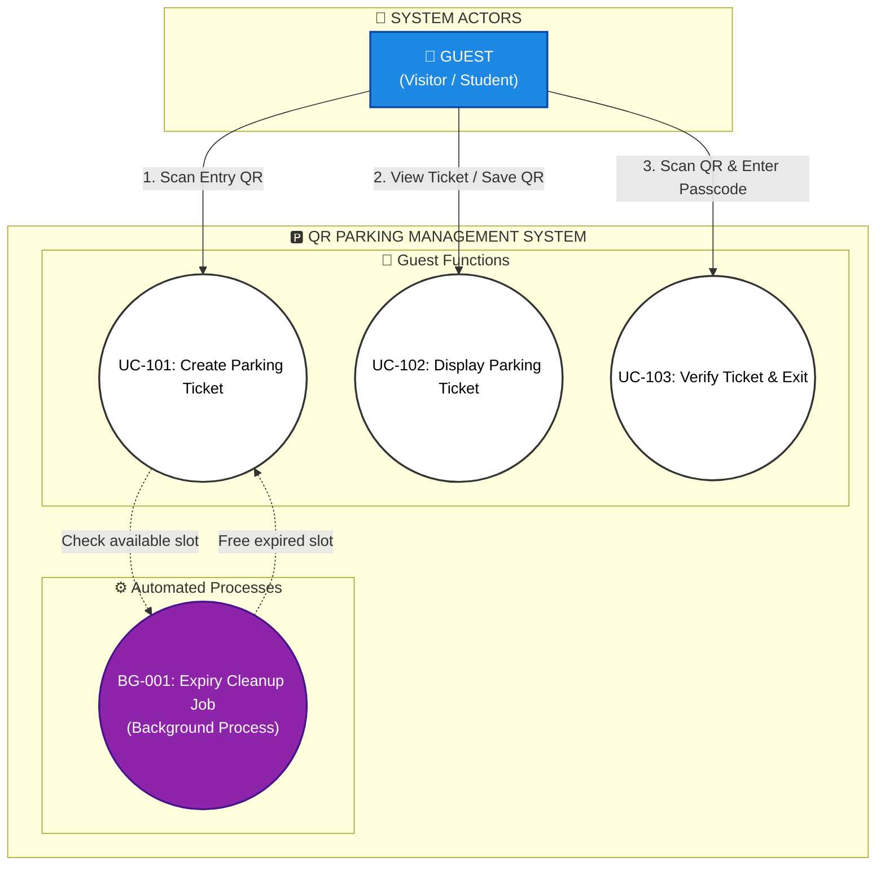
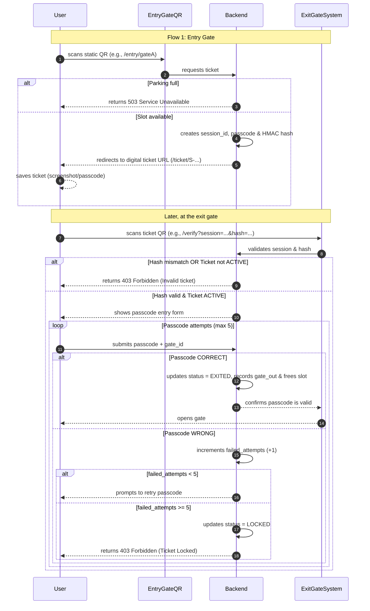
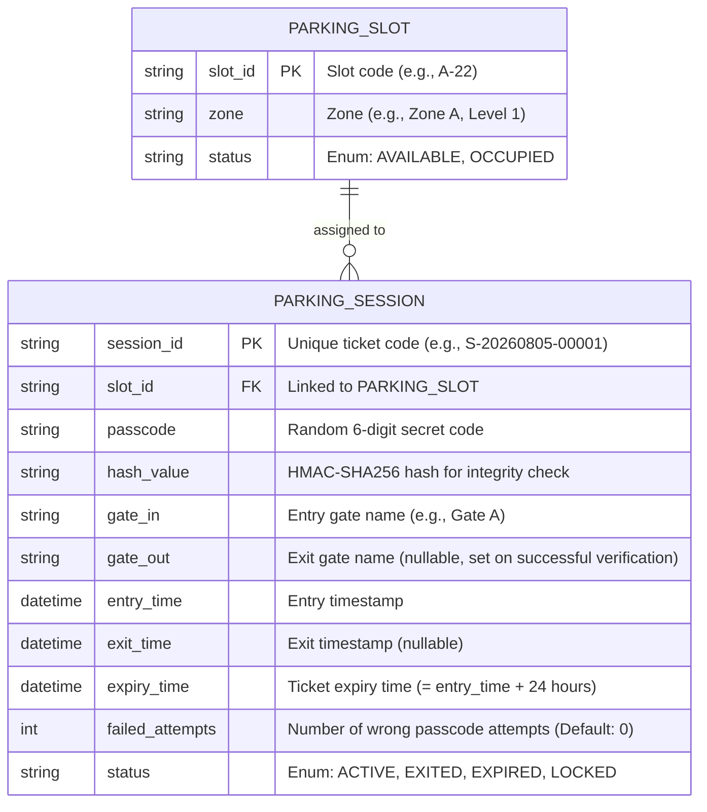

# 🅿️ Guest Parking QR System (Smart QR Parking)

An anonymous, security-focused parking management system for guests (Guest/Student) built on Python (FastAPI/Flask). The system lets users scan a static QR code at the entry gate to receive a digital ticket, park their vehicle, and verify with a secret Passcode at the exit gate — **with no account registration or mobile app installation required**.

---

## 🎯 Project Objective

- **Simple & Convenient:** Guests can park using only their phone camera and a web browser.
- **Anonymous:** No personal data collected (name, phone number, email).
- **Safe & Secure:** Prevents ticket forgery (HMAC Hash), prevents reuse (Single-use), prevents brute-force passcode guessing (Brute-Force Protection), and automatically checks parking capacity.
- **Demo-Friendly:** Clear modular architecture, easy to implement as a Python project.

---

## 👤 Actors & User Stories

### 1. Guest (Visitor / Student)
* **Entry Flow:** As a guest, I want to scan a QR code at the entrance gate so that I can get an assigned parking spot and a digital ticket without installing an app.
* **Exit Flow:** As a guest, I want to scan my digital ticket QR at the exit gate and enter my passcode so that I can leave the parking garage quickly and safely.

### 2. System (Self-operating)
* **Fraud Prevention:** As the system, I want to automatically block reuse or forgery of tickets and limit failed passcode attempts so that fraud is prevented without human intervention.
* **Data Cleanup:** As the system, I want expired tickets to be automatically cleaned up so that parking slots are freed for new users.

> **Design Note:** The system runs on a **nologin** model — there is no user account and no admin dashboard. "Management" happens **automatically based on each parking session's lifecycle**, not tracked per user.

---

## 📐 System Diagrams

### 1. Use Case Diagram


```mermaid
graph TD
    classDef actorStyle fill:#1e88e5,stroke:#0d47a1,stroke-width:2px,color:#fff;
    classDef usecaseStyle fill:#ffffff,stroke:#333,stroke-width:2px,color:#000;
    classDef bgStyle fill:#8e24aa,stroke:#4a148c,stroke-width:2px,color:#fff;

    subgraph Actors ["👥 SYSTEM ACTORS"]
        Guest["👤 GUEST<br/>(Visitor / Student)"]:::actorStyle
    end

    subgraph SystemBoundary ["🅿️ QR PARKING MANAGEMENT SYSTEM"]
        direction TB

        subgraph GuestModule ["📱 Guest Functions"]
            UC101(("UC-101: Create Parking Ticket")):::usecaseStyle
            UC102(("UC-102: Display Parking Ticket")):::usecaseStyle
            UC103(("UC-103: Verify Ticket & Exit")):::usecaseStyle
        end

        subgraph SystemModule ["⚙️ Automated Processes"]
            BG001(("BG-001: Expiry Cleanup Job<br/>(Background Process)")):::bgStyle
        end
    end

    Guest -->|1. Scan Entry QR| UC101
    Guest -->|2. View Ticket / Save QR| UC102
    Guest -->|3. Scan QR & Enter Passcode| UC103

    UC101 -.->|Check available slot| BG001
    BG001 -.->|Free expired slot| UC101
```

---

### 2. Entry & Exit Sequence Diagram


```mermaid
sequenceDiagram
    autonumber
    participant User as User
    participant EntryGateQR as EntryGateQR
    participant Backend as Backend
    participant ExitGateSystem as ExitGateSystem

    Note over User, ExitGateSystem: Flow 1: Entry Gate
    User->>EntryGateQR: scans static QR (e.g., /entry/gateA)
    EntryGateQR->>Backend: requests ticket
    alt Parking full
        Backend-->>User: returns 503 Service Unavailable
    else Slot available
        Backend->>Backend: creates session_id, passcode & HMAC hash
        Backend-->>User: redirects to digital ticket URL (/ticket/S-...)
        User-->>User: saves ticket (screenshot/passcode)
    end

    Note over User, ExitGateSystem: Later, at the exit gate

    User->>ExitGateSystem: scans ticket QR (e.g., /verify?session=...&hash=...)
    ExitGateSystem->>Backend: validates session & hash
    alt Hash mismatch OR Ticket not ACTIVE
        Backend-->>User: returns 403 Forbidden (Invalid ticket)
    else Hash valid & Ticket ACTIVE
        Backend-->>User: shows passcode entry form
        loop Passcode attempts (max 5)
            User->>Backend: submits passcode + gate_id
            alt Passcode CORRECT
                Backend->>Backend: updates status = EXITED, records gate_out & frees slot
                Backend-->>ExitGateSystem: confirms passcode is valid
                ExitGateSystem-->>User: opens gate
            else Passcode WRONG
                Backend->>Backend: increments failed_attempts (+1)
                alt failed_attempts < 5
                    Backend-->>User: prompts to retry passcode
                else failed_attempts >= 5
                    Backend->>Backend: updates status = LOCKED
                    Backend-->>User: returns 403 Forbidden (Ticket Locked)
                end
            end
        end
    end
```

---

## 🗄️ Data Model (ER Diagram)


```mermaid
erDiagram
    PARKING_SLOT ||--o{ PARKING_SESSION : "assigned to"

    PARKING_SLOT {
        string slot_id PK "Slot code (e.g., A-22)"
        string zone "Zone (e.g., Zone A, Level 1)"
        string status "Enum: AVAILABLE, OCCUPIED"
    }

    PARKING_SESSION {
        string session_id PK "Unique ticket code (e.g., S-20260805-00001)"
        string slot_id FK "Linked to PARKING_SLOT"
        string passcode "Random 6-digit secret code"
        string hash_value "HMAC-SHA256 hash for integrity check"
        string gate_in "Entry gate name (e.g., Gate A)"
        string gate_out "Exit gate name (nullable, set on successful verification)"
        datetime entry_time "Entry timestamp"
        datetime exit_time "Exit timestamp (nullable)"
        datetime expiry_time "Ticket expiry time (= entry_time + 24 hours)"
        int failed_attempts "Number of wrong passcode attempts (Default: 0)"
        string status "Enum: ACTIVE, EXITED, EXPIRED, LOCKED"
    }
```

---

## 🛠️ REST API Endpoints Specification

| Endpoint | Method | Use Case | Description | Success Response | Error Response |
| :--- | :--- | :--- | :--- | :--- | :--- |
| `/entry/{gate_id}` | `GET` | **UC-101** | Scan entry QR. Checks slot availability, creates a session, assigns a slot, records `gate_in`, and redirects to the ticket page. | `302 Found` (Redirect to `/ticket/{session_id}`) | `503 Service Unavailable` (`"No available slots"`) |
| `/ticket/{session_id}` | `GET` | **UC-102** | Displays the digital ticket (slot, passcode, exit QR code). | `200 OK` (HTML Ticket Page) | `404 Not Found` (`"Ticket not found"`) |
| `/verify` | `GET` | **UC-103** | Validates the exit QR (`hash` and `expiry_time`). If valid, returns the passcode entry form. | `200 OK` (HTML Passcode Form) | `403 Forbidden` (`"Invalid or expired ticket"`) |
| `/verify` | `POST` | **UC-103** | Processes the passcode (with exit `gate_id`). Checks correctness, increments `failed_attempts`, records `gate_out` + `exit_time`, updates status to `EXITED` or `LOCKED`. | `200 OK` (`"Verification successful. Gate opening."`) | `403 Forbidden` (`"Invalid passcode"` or `"Ticket LOCKED"`) |

---

## 🔐 Security & Logic Highlights

1. **Forgery Prevention:** Every URL on the ticket QR includes a `hash = HMAC-SHA256(SECRET_KEY, session_id)`. Tampering with `session_id` invalidates the hash.
2. **Brute-Force Protection:** After scanning the exit QR successfully, users have up to 5 passcode attempts. After 5 failed attempts, the session becomes **`LOCKED`** and requires manual staff intervention (lookup via `session_id`).
3. **Automated Background Cleanup:** A Cron Job (`BG-001`) runs every 5 minutes, scanning sessions where `status == ACTIVE` but `expiry_time < Current_Time`. It automatically updates `status = EXPIRED` and sets the `PARKING_SLOT` back to `AVAILABLE`. **Tickets are valid for 24 hours from entry (`entry_time`)**, configurable via environment variable.

---

## ⚠️ Weak Points & Mitigations

| Issue | Mitigation |
| :--- | :--- |
| User shares QR + passcode with someone else | Short expiry, or record vehicle photo at entry |
| Printed/screenshotted ticket stolen | Single-use + expiry limit |
| `SECRET_KEY` leakage | Keep in environment variables, never hard-coded in source |
| Lost passcode | Allow staff verification via `session_id` lookup |

---

## ✅ Advantages

- Works with any smartphone camera, no app installation needed
- Secure enough for university or small public use
- Stateless for users; backend stores minimal data
- Scalable: each gate only needs one static QR code; all logic lives in the backend

---

## 🎯 Summary

> This design combines QR hash verification and one-time passcodes to provide a secure, anonymous parking ticket system without user accounts. It prevents forgery, reuse, and brute-force guessing — while remaining simple enough for university-scale deployment and demonstration.

---

## 📁 Project Structure

```text
guest-parking-qr/
├── alembic/                  # Database migration scripts
├── alembic.ini              # Alembic configuration
├── tests/                    # Unit & integration tests
│   ├── conftest.py
│   ├── test_api.py
│   └── test_services.py
├── app/                      # Main application source code
│   ├── __init__.py
│   ├── api/
│   │   └── v1/
│   │       └── tickets.py    # API router for /entry, /ticket, /verify
│   ├── core/
│   │   ├── config.py         # Pydantic settings & SECRET_KEY
│   │   └── security.py       # HMAC hash & passcode generation
│   ├── crud/
│   │   └── parking.py        # Database operations (create session, update slot)
│   ├── db/
│   │   ├── base.py
│   │   ├── database.py       # DB session management
│   │   └── models.py         # SQLAlchemy ORM models (ParkingSlot, ParkingSession)
│   ├── schemas/
│   │   └── ticket.py         # Pydantic schemas for the API
│   ├── services/
│   │   ├── ticket_service.py # Core business logic
│   │   └── cleanup_job.py    # Background job for expired tickets
│   └── main.py               # FastAPI application entrypoint
├── .env.example
├── .gitignore
├── pyproject.toml
└── README.md
```

---

## 🚀 Run Locally

```bash
git clone https://github.com/bvkjdbdbbd/hello.git
cd hello
.\venv\Scripts\activate
pip install -r requirements.txt
python -m uvicorn app.main:app --reload
```
