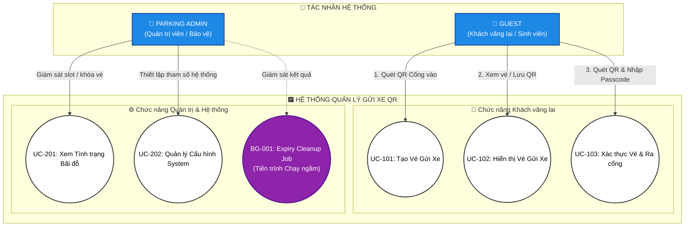
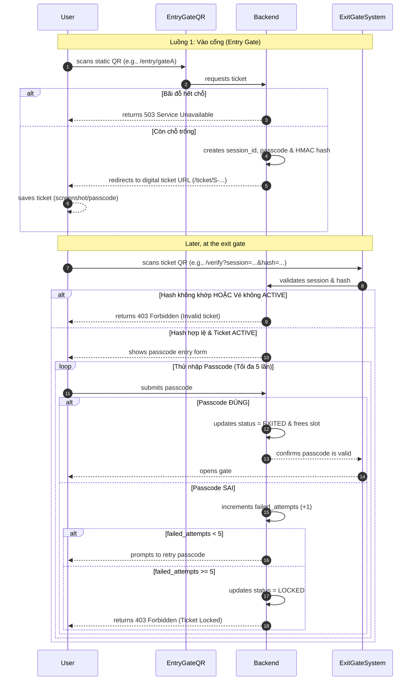
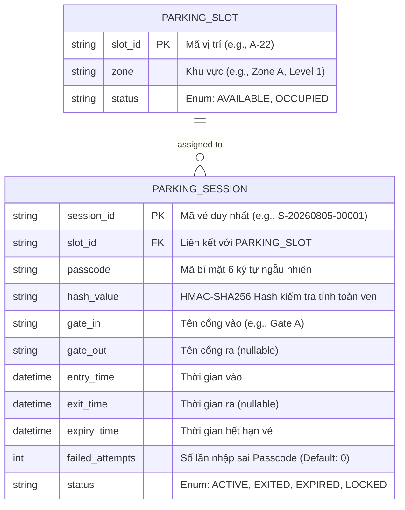

# 🅿️ Guest Parking QR System (Smart QR Parking)

Một hệ thống quản lý gửi xe an danh, bảo mật dành cho khách vãng lai (Guest/Sinh viên) dựa trên nền tảng Python (FastAPI/Flask). Hệ thống cho phép người dùng quét mã QR tĩnh tại cổng vào để nhận vé kỹ thuật số, gửi xe và xác thực bằng mã Passcode bí mật khi ra cổng — **hoàn toàn không cần đăng ký tài khoản hay cài đặt ứng dụng di động**.

---

## 🎯 Mục tiêu Dự án (Project Objective)

- **Đơn giản & Tiện lợi:** Cho phép khách gửi xe chỉ bằng camera điện thoại và trình duyệt web.
- **An danh (Anonymous):** Không thu thập dữ liệu cá nhân (tên, SĐT, email).
- **An toàn & Bảo mật:** Chống làm giả vé (HMAC Hash), chống sử dụng lại (Single-use), chống dò mã (Brute-Force Protection) và kiểm tra dung lượng bãi đỗ tự động.
- **Thích hợp cho Demo:** Kiến trúc mô-đun rõ ràng, dễ dàng triển khai đồ án với Python.

---

## 👤 Đối tượng & User Stories

### 1. Guest (Khách vãng lai / Sinh viên)
* **Luồng Vào:** As a guest, I want to scan a QR code at the entrance gate so that I can get an assigned parking spot and a digital ticket without installing an app.
* **Luồng Ra:** As a guest, I want to scan my digital ticket QR at the exit gate and enter my passcode so that I can leave the parking garage quickly and safely.

### 2. Parking Administrator (Bảo vệ / Quản trị viên)
* **Quản lý Vận hành:** As an admin, I want the system to automatically block reuse or forgery of tickets and limit failed passcode attempts to prevent fraud.
* **Quản lý Dữ liệu:** As an admin, I want expired tickets to be automatically cleaned up so that parking slots are freed for new users.

---

## 📐 Sơ Đồ Hệ Thống (Diagrams)

### 1. Sơ Đồ Use Case Tổng Quát (Use Case Diagram)


```mermaid
graph TD
    classDef actorStyle fill:#1e88e5,stroke:#0d47a1,stroke-width:2px,color:#fff;
    classDef usecaseStyle fill:#ffffff,stroke:#333,stroke-width:2px,color:#000;
    classDef bgStyle fill:#8e24aa,stroke:#4a148c,stroke-width:2px,color:#fff;

    subgraph Actors ["👥 TÁC NHÂN HỆ THỐNG"]
        Guest["👤 GUEST<br/>(Khách vãng lai / Sinh viên)"]:::actorStyle
        Admin["👮 PARKING ADMIN<br/>(Quản trị viên / Bảo vệ)"]:::actorStyle
    end

    subgraph SystemBoundary ["🅿️ HỆ THỐNG QUẢN LÝ GỬI XE QR"]
        direction TB
        
        subgraph GuestModule ["📱 Chức năng Khách vãng lai"]
            UC101(("UC-101: Tạo Vé Gửi Xe")):::usecaseStyle
            UC102(("UC-102: Hiển thị Vé Gửi Xe")):::usecaseStyle
            UC103(("UC-103: Xác thực Vé & Ra cổng")):::usecaseStyle
        end
        
        subgraph AdminModule ["⚙️ Chức năng Quản trị & Hệ thống"]
            UC201(("UC-201: Xem Tình trạng Bãi đỗ")):::usecaseStyle
            UC202(("UC-202: Quản lý Cấu hình System")):::usecaseStyle
            BG001(("BG-001: Expiry Cleanup Job<br/>(Tiến trình Chạy ngầm)")):::bgStyle
        end
    end

    Guest -->|1. Quét QR Cổng vào| UC101
    Guest -->|2. Xem vé / Lưu QR| UC102
    Guest -->|3. Quét QR & Nhập Passcode| UC103

    Admin -->|Giám sát slot / khóa vé| UC201
    Admin -->|Thiết lập tham số hệ thống| UC202
    Admin -.->|Giám sát kết quả| BG001
```

---

### 2. Sơ Đồ Trình Tự Luồng Vào & Ra (Sequence Diagram)


```mermaid
sequenceDiagram
    autonumber
    participant User as User
    participant EntryGateQR as EntryGateQR
    participant Backend as Backend
    participant ExitGateSystem as ExitGateSystem

    Note over User, ExitGateSystem: Luồng 1: Vào cổng (Entry Gate)
    User->>EntryGateQR: scans static QR (e.g., /entry/gateA)
    EntryGateQR->>Backend: requests ticket
    alt Bãi đỗ hết chỗ
        Backend-->>User: returns 503 Service Unavailable
    else Còn chỗ trống
        Backend->>Backend: creates session_id, passcode & HMAC hash
        Backend-->>User: redirects to digital ticket URL (/ticket/S-...)
        User-->>User: saves ticket (screenshot/passcode)
    end

    Note over User, ExitGateSystem: Later, at the exit gate

    User->>ExitGateSystem: scans ticket QR (e.g., /verify?session=...&hash=...)
    ExitGateSystem->>Backend: validates session & hash
    alt Hash không khớp HOẶC Vé không ACTIVE
        Backend-->>User: returns 403 Forbidden (Invalid ticket)
    else Hash hợp lệ & Ticket ACTIVE
        Backend-->>User: shows passcode entry form
        loop Thử nhập Passcode (Tối đa 5 lần)
            User->>Backend: submits passcode
            alt Passcode ĐÚNG
                Backend->>Backend: updates status = EXITED & frees slot
                Backend-->>ExitGateSystem: confirms passcode is valid
                ExitGateSystem-->>User: opens gate
            else Passcode SAI
                Backend->>Backend: increments failed_attempts (+1)
                alt failed_attempts < 5
                    Backend-->>User: prompts to retry passcode
                else failed_attempts >= 5
                    Backend->>Backend: updates status = LOCKED
                    Backend-->>User: returns 403 Forbidden (Ticket Locked)
                end
            end
        end
    end
```

---

## 🗄️ Mô Hình Dữ Liệu (ER Diagram)


```mermaid
erDiagram
    PARKING_SLOT ||--o{ PARKING_SESSION : "assigned to"

    PARKING_SLOT {
        string slot_id PK "Mã vị trí (e.g., A-22)"
        string zone "Khu vực (e.g., Zone A, Level 1)"
        string status "Enum: AVAILABLE, OCCUPIED"
    }

    PARKING_SESSION {
        string session_id PK "Mã vé duy nhất (e.g., S-20260805-00001)"
        string slot_id FK "Liên kết với PARKING_SLOT"
        string passcode "Mã bí mật 6 ký tự ngẫu nhiên"
        string hash_value "HMAC-SHA256 Hash kiểm tra tính toàn vẹn"
        string gate_in "Tên cổng vào (e.g., Gate A)"
        string gate_out "Tên cổng ra (nullable)"
        datetime entry_time "Thời gian vào"
        datetime exit_time "Thời gian ra (nullable)"
        datetime expiry_time "Thời gian hết hạn vé"
        int failed_attempts "Số lần nhập sai Passcode (Default: 0)"
        string status "Enum: ACTIVE, EXITED, EXPIRED, LOCKED"
    }
```

---

## 🛠️ REST API Endpoints Specification

| Endpoint | Method | Mới/Cũ | Mô tả Chức năng | Response Thành công | Response Lỗi |
| :--- | :--- | :--- | :--- | :--- | :--- |
| `/entry/{gate_id}` | `GET` | **UC-101** | Quét QR cổng vào. Kiểm tra chỗ trống, khởi tạo Session, gán Slot và Redirect tới trang vé. | `302 Found` (Redirect tới `/ticket/{session_id}`) | `503 Service Unavailable` (`"No available slots"`) |
| `/ticket/{session_id}` | `GET` | **UC-102** | Hiển thị giao diện vé gửi xe (Slot, Passcode, QR code ra cổng). | `200 OK` (HTML Ticket Page) | `404 Not Found` (`"Ticket not found"`) |
| `/verify` | `GET` | **UC-103** | Xác thực QR ra cổng (Validate `hash` và `expiry_time`). Nếu hợp lệ, trả về form nhập Passcode. | `200 OK` (HTML Passcode Form) | `403 Forbidden` (`"Invalid or expired ticket"`) |
| `/verify` | `POST` | **UC-103** | Xử lý Passcode. Kiểm tra đúng/sai, tăng `failed_attempts`, chuyển trạng thái `EXITED` hoặc `LOCKED`. | `200 OK` (`"Verification successful. Gate opening."`) | `403 Forbidden` (`"Invalid passcode"` hoặc `"Ticket LOCKED"`) |

---

## 🔐 Cơ Chế Bảo Mật & Quản Lý Vận Hành (Security & Logic Highlights)

1. **Chống Làm Giả Vé (Forgery Prevention):** Mỗi URL trên QR vé đều đi kèm mã `hash = HMAC-SHA256(SECRET_KEY, session_id)`. Kẻ gian sửa `session_id` sẽ làm sai Hash.
2. **Chống Tấn Công Dò Mã (Brute-Force Protection):** Khi quét thành công QR ra cổng, người dùng có tối đa 5 lần nhập Passcode. Nếu sai quá 5 lần, Session chuyển sang trạng thái **`LOCKED`** và yêu cầu Admin/Bảo vệ can thiệp.
3. **Luồng Chạy Ngầm Tự Động (Background Cleanup Job):** Một tiến trình Cron Job (`BG-001`) chạy ngầm định kỳ 5 phút/lần quét các phiên có `status == ACTIVE` nhưng `expiry_time < Current_Time`. Tiến trình này sẽ tự động cập nhật `status = EXPIRED` và đưa `PARKING_SLOT` về trạng thái `AVAILABLE`.

---

## 📁 Cấu Trúc File Dự Án (Project Structure)

```text
guest-parking-qr/
├── alembic/                  # Database migration scripts
├── alembic.ini              # Config Alembic
├── tests/                    # Unit & Integration tests
│   ├── conftest.py
│   ├── test_api.py
│   └── test_services.py
├── app/                      # Mã nguồn chính của ứng dụng Python
│   ├── __init__.py
│   ├── api/
│   │   └── v1/
│   │       └── tickets.py    # API Router xử lý /entry, /ticket, /verify
│   ├── core/
│   │   ├── config.py         # Cấu hình Pydantic & SECRET_KEY
│   │   └── security.py       # Hàm tính toán HMAC Hash & Tạo Passcode
│   ├── crud/
│   │   └── parking.py        # Thao tác CSDL (Create Session, Update Slot)
│   ├── db/
│   │   ├── base.py
│   │   ├── database.py       # Kết nối Session DB
│   │   └── models.py         # SQLAlchemy ORM Models (ParkingSlot, ParkingSession)
│   ├── schemas/
│   │   └── ticket.py         # Pydantic Schemas cho API
│   ├── services/
│   │   ├── ticket_service.py # Logic nghiệp vụ chính
│   │   └── cleanup_job.py    # Background job xử lý vé hết hạn
│   └── main.py               # FastAPI App Entrypoint
├── .env.example
├── .gitignore
├── pyproject.toml
└── README.md
```

---

## 🚀 Dự án (Run Locally)

```bash
git clone https://github.com/bvkjdbdbbd/hello.git
cd hello
.\venv\Scripts\activate
pip install -r requirements.txt
python -m uvicorn app.main:app --reload
```

 Châu Anh 


